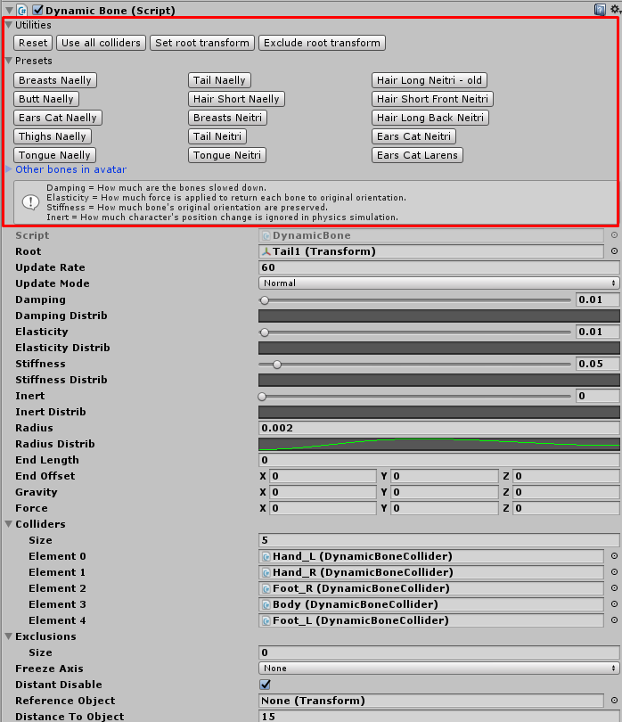

# Neitri-Unity-Scripts
Collection of scripts for Unity3D and VRChat.

# Propagate To VRC Portrait Camera
- Allows for easier setup of VRChat portrait capture
- Add it under Camera that you want to use as VRC Portrait Camera
- Propagates Camera Component position rotation and other properties to camera used for VRChat portrait capture

# Custom Editors
## DynamicBone
- Custom editor for DynamicBone
- Adds various presets, utilites and usefeul info to DynamicBone

## VRC_AvatarDescriptor
- Custom editor for VRC_AvatarDescriptor
- Adds various warnings and fix buttons to VRC_AvatarDescriptor
